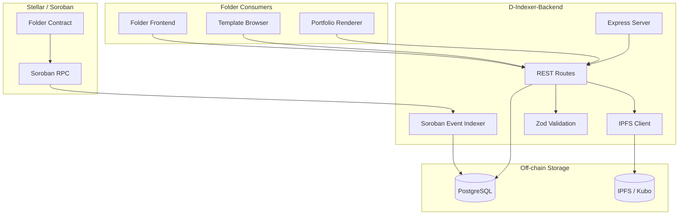
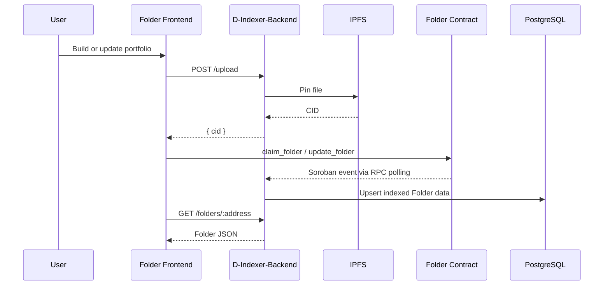

# D-Indexer-Backend ⚙️

[](https://github.com/D-Indexer/D-Indexer-Backend/actions/workflows/ci.yml)
[](https://stellar.org)
[](https://soroban.stellar.org)
[](package.json)
[](tsconfig.json)

Core API and indexing engine for Folder — handling off-chain Folder data, IPFS uploads, metadata caching, and Stellar/Soroban ledger hooks for template rendering.

## Overview

D-Indexer-Backend is the off-chain backbone of the Folder platform. It streams Soroban contract events from the Stellar ledger, indexes Folder records into PostgreSQL, pins portfolio files to IPFS, and exposes a REST API consumed by the Folder frontend.

The Stellar ledger is the source of truth. PostgreSQL is a rebuildable read cache that keeps Folder lookups, template metadata, credential queries, and health checks fast for the application layer.

### The Problem

Folder stores durable ownership and event history on Stellar, but the frontend needs fast, practical access to derived data:

- **Ledger data is event-based**, so clients need an indexed view of the latest Folder state
- **Portfolio assets are off-chain files**, so they need to be pinned and resolved through IPFS
- **Template browsing needs cached metadata**, because contract reads alone are not ideal for common UI queries
- **Credentials need queryable records**, so verified links can be displayed without replaying ledger history on every request
- **Frontend rendering needs low-latency APIs**, while the chain remains the final source of truth

This service bridges those needs by listening to contract events, maintaining PostgreSQL tables, and serving application-specific REST endpoints.

### What D-Indexer-Backend Does

At a high level, it does three things:

- **📡 Indexes** — polls Soroban RPC for Folder contract events every five seconds, decodes event topics, persists an indexer cursor, and upserts Folder, credential, and template rows
- **📦 Stores** — uploads portfolio assets to IPFS through a Kubo RPC endpoint and returns CIDs for on-chain or application use
- **🔌 Serves** — exposes REST endpoints for Folder lookup, name resolution, credential lookup, template browsing, upload, and service health

## Features

- **Ledger Indexer**: streams Soroban contract events, filters by `FOLDER_CONTRACT_ID`, persists `indexer_cursor`, and upserts records on conflict
- **IPFS Integration**: pins portfolio files through Kubo RPC and returns content identifiers
- **REST API**: Folder lookup, claimed-name resolution, credential queries, template browsing, file upload, and health status
- **Input Validation**: Zod schemas for Stellar addresses, template IDs, upload MIME types, and upload size
- **Upload Safety Limits**: accepts JPEG, PNG, WebP, and PDF files up to 10 MB via in-memory Multer storage
- **PostgreSQL Cache**: stores folders, credentials, templates, and indexer state in simple rebuildable tables
- **Error Handling**: async route wrapper plus global JSON error middleware
- **Health Endpoint**: checks database reachability and reports the latest indexer cursor, returning `503` when the database is unreachable

## Architecture



### Core Components

- **src/server.ts**: Express entry point; registers route groups, global middleware, error handling, and starts the indexer
- **src/indexer/stellar.ts**: Soroban event poller, event topic decoder, cursor persistence, and PostgreSQL writer
- **src/db/client.ts**: PostgreSQL `pg` pool singleton
- **src/db/migrate.ts**: SQL migrations for folders, credentials, templates, and indexer state
- **src/services/folder.ts**: Folder and credential query layer
- **src/services/template.ts**: Template query layer
- **src/services/ipfs.ts**: Kubo RPC client, file pinning, and gateway URL construction
- **src/controllers/**: HTTP request handlers for Folder, template, and upload routes
- **src/routes/**: Express route registration for `/folders`, `/templates`, `/upload`, and `/health`
- **src/validation/schemas.ts**: Zod validation schemas for addresses, template IDs, and uploads
- **src/middleware/**: Async handler and global error handler
- **src/__tests__/**: Jest tests for services, indexer behavior, and upload handling

## Folder Indexing on Stellar

The backend treats Soroban events as the canonical input stream. It polls the configured RPC endpoint and filters events to the configured Folder contract ID.

| Event | Indexed action |
| ----- | -------------- |
| `folder_claimed` | Insert or update a Folder record |
| `folder_updated` | Update Folder name, CID, template ID, and timestamp |
| `credential_linked` | Insert or update a credential proof hash |
| `folder_transferred` | Move Folder ownership to the recipient address |
| `template_registered` | Insert or update a template metadata CID |
| `template_deprecated` | Mark a template as deprecated |

The indexer stores its next ledger position in `indexer_state` under the `indexer_cursor` key.

## REST API Layer

The Express API is designed for the Folder frontend and related UI clients.

See [docs/api.md](docs/api.md) for the expanded API reference.

| Method | Path | Description |
| ------ | ---- | ----------- |
| `GET` | `/folders/:address` | Fetch a Folder by Stellar address |
| `GET` | `/folders/name/:name` | Resolve a Folder by claimed name |
| `GET` | `/folders/:address/credentials` | List credentials linked to a Folder owner |
| `GET` | `/templates` | List active templates |
| `GET` | `/templates/:id` | Fetch one template |
| `POST` | `/upload` | Pin a file to IPFS and return `{ cid }` |
| `GET` | `/health` | Return database and indexer status |

### Upload Contract

`POST /upload` expects multipart form data with a single `file` field.

| Constraint | Value |
| ---------- | ----- |
| Field name | `file` |
| Max size | 10 MB |
| Allowed MIME types | `image/jpeg`, `image/png`, `image/webp`, `application/pdf` |
| Success response | `{ "cid": "<ipfs-cid>" }` |

### `/health` response contract

When PostgreSQL is reachable:

```json
{
  "status": "ok",
  "db": "ok",
  "indexer": {
    "cursor": "12345"
  }
}
```

When PostgreSQL is unreachable, the endpoint returns HTTP `503`:

```json
{
  "status": "degraded",
  "db": "unreachable",
  "indexer": {
    "cursor": null
  }
}
```

## Data Model

These are the canonical TypeScript shapes exposed internally by this backend.

```typescript
interface Folder {
  owner: string;       // Stellar address, usually G...
  name: string;        // claimed human-readable Folder name
  cid: string;         // IPFS CID for portfolio content
  templateId: number;  // references Template.id
  updatedAt: Date;
}

interface Credential {
  owner: string;
  platform: string;
  proofHash: string;
  linkedAt: Date;
}

interface Template {
  id: number;
  metadataCid: string;
  deprecated: boolean;
  createdAt: Date;
}
```

## Database Schema

```sql
CREATE TABLE IF NOT EXISTS folders (
  owner       TEXT PRIMARY KEY,
  name        TEXT UNIQUE NOT NULL,
  cid         TEXT NOT NULL,
  template_id INTEGER NOT NULL,
  updated_at  TIMESTAMPTZ NOT NULL DEFAULT NOW()
);

CREATE TABLE IF NOT EXISTS credentials (
  id          SERIAL PRIMARY KEY,
  owner       TEXT NOT NULL REFERENCES folders(owner),
  platform    TEXT NOT NULL,
  proof_hash  TEXT NOT NULL,
  linked_at   TIMESTAMPTZ NOT NULL DEFAULT NOW(),
  UNIQUE (owner, platform)
);

CREATE TABLE IF NOT EXISTS templates (
  id           SERIAL PRIMARY KEY,
  metadata_cid TEXT NOT NULL,
  deprecated   BOOLEAN NOT NULL DEFAULT FALSE,
  created_at   TIMESTAMPTZ NOT NULL DEFAULT NOW()
);

CREATE TABLE IF NOT EXISTS indexer_state (
  key   TEXT PRIMARY KEY,
  value TEXT NOT NULL
);
```

## Repository Structure

```text
config/                         # Safe committed configuration examples
database/                       # Schema docs, seeds, future raw migrations
deploy/                         # Docker, Compose, and deployment scaffolding
docs/                           # Architecture, API, operations, security, runbooks
examples/                       # Safe usage examples
monitoring/                     # Observability and alerting notes
scripts/                        # Developer and maintenance scripts
src/
├── server.ts                    # Express entry point
├── types/index.ts               # Shared TypeScript types
├── validation/schemas.ts        # Zod validation schemas
├── middleware/
│   ├── asyncHandler.ts          # Wraps async routes and forwards errors
│   └── errorHandler.ts          # Global Express error handler
├── db/
│   ├── client.ts                # PostgreSQL pool singleton
│   └── migrate.ts               # SQL migrations
├── indexer/
│   └── stellar.ts               # Soroban event poller and DB writer
├── services/
│   ├── folder.ts                # Folder and credential DB queries
│   ├── template.ts              # Template DB queries
│   └── ipfs.ts                  # IPFS pinning and gateway URL helper
├── controllers/
│   ├── folder.controller.ts
│   ├── template.controller.ts
│   └── upload.controller.ts
├── routes/
│   ├── folder.routes.ts
│   ├── template.routes.ts
│   ├── upload.routes.ts
│   └── health.routes.ts
└── __tests__/
    ├── folder.service.test.ts
    ├── indexer.test.ts
    └── upload.controller.test.ts
tooling/                        # Tooling notes and future shared config
```

## Quick Start

### 1. Install dependencies

```bash
npm install
```

### 2. Configure environment

```bash
cp .env.example .env
```

Fill in the required values:

| Variable | Description |
| -------- | ----------- |
| `PORT` | HTTP server port, defaults to `3000` |
| `NODE_ENV` | Runtime environment, usually `development` locally |
| `DATABASE_URL` | PostgreSQL connection string |
| `STELLAR_RPC_URL` | Soroban RPC endpoint |
| `STELLAR_NETWORK_PASSPHRASE` | Stellar network passphrase |
| `FOLDER_CONTRACT_ID` | Deployed Folder contract ID |
| `IPFS_API_URL` | Kubo/IPFS API endpoint for file pinning |
| `IPFS_GATEWAY` | Public gateway base URL for resolving CIDs |
| `WEBHOOK_SECRET` | Optional webhook secret reserved for integrations |

### 3. Start PostgreSQL

One local option:

```bash
docker run -p 5432:5432 -e POSTGRES_PASSWORD=password postgres:16
```

Make sure `DATABASE_URL` in `.env` points to the database you start.

### 4. Run migrations

```bash
npm run db:migrate
```

### 5. Start the development server

```bash
npm run dev
```

The API starts on `http://localhost:3000` unless `PORT` is changed. The Soroban indexer starts with the server.

### Docker

This repository does not currently include a Dockerfile or Compose stack. For local development, run PostgreSQL separately and start the Node.js service with `npm run dev`.

## CLI Reference

| Command | Description |
| ------- | ----------- |
| `npm run dev` | Start the TypeScript server with hot reload |
| `npm run build` | Compile TypeScript into `dist/` |
| `npm start` | Run the compiled JavaScript entry point |
| `npm test` | Run the Jest test suite |
| `npm run db:migrate` | Apply PostgreSQL migrations |

## Contract Functions Used by the Folder System

The backend does not submit these transactions directly in the current codebase; it indexes the events emitted by the Folder contract after these actions occur elsewhere in the system.

| Function | Purpose |
| -------- | ------- |
| `claim_folder` | Mint or claim a Folder profile |
| `update_folder` | Update the Folder metadata CID or template |
| `link_credential` | Link an external credential proof on-chain |
| `transfer_folder` | Transfer Folder ownership |
| `register_template` | Register a new Folder template |

## Multi-Repo Architecture

This repo is one part of the Folder system.

```text
folder-org/
├── Folder-Frontend      # React/Vite portfolio UI, wallet auth, template browser
├── D-Indexer-Backend    # TypeScript/Node.js API, indexer, IPFS integration
└── Folder-Contract      # Rust/Soroban on-chain Folder logic
```

### Data Flow



### Shared Contracts (must stay in sync across repos)

| Contract | Backend dependency |
| -------- | ------------------ |
| Folder event names | `src/indexer/stellar.ts` switch cases |
| Event topic ordering | Topic decoding and argument extraction in the indexer |
| Folder response shape | `src/types/index.ts` and frontend API client |
| Template identifiers | `templates.id`, `template_id`, and frontend template browser |
| IPFS CID semantics | Upload response and contract metadata fields |

See [docs/events.md](docs/events.md) for the event indexing contract.

### Cross-Repo Change Protocol

1. **Contract event change** — update `src/indexer/stellar.ts` in this repo at the same time.
2. **API response change** — update the Folder frontend API client and any consuming UI.
3. **Shared type change** — propagate the type update across backend, frontend, and contract documentation.
4. **Environment variable change** — update `.env.example` and deployment configuration together.

## Testing

```bash
npm test
```

For the full verification workflow, see [docs/testing.md](docs/testing.md).

The Jest suite currently covers:

- Folder service queries
- Soroban indexer behavior
- Upload controller validation and IPFS pinning behavior

## Roadmap

### Phase 1 — Backend Foundation

- Maintain stable Folder, credential, template, upload, and health endpoints
- Keep migrations idempotent for local and deployment use
- Keep event indexing replayable from the stored cursor

### Phase 2 — Production Hardening

- Add structured logging around indexer polling, event handling, and API failures
- Add metrics for indexer lag, failed RPC calls, upload failures, and database latency
- Add deployment-ready container and Compose configuration if the service is run in containers

### Phase 3 — Folder Ecosystem Integration

- Coordinate shared response contracts with Folder-Frontend
- Keep Soroban event names and topic ordering synchronized with Folder-Contract
- Extend credential support as external verification flows mature

## Why This Matters for the Folder Ecosystem

D-Indexer-Backend gives Folder a practical application layer without weakening the ledger-first model. The contract remains the durable source of truth, while this service provides the indexed views, file pinning, and fast JSON APIs that make Folder usable in a browser.

## Dependencies

| Package | Purpose |
| ------- | ------- |
| `express` | HTTP server and route handling |
| `@stellar/stellar-sdk` | Soroban RPC access and ScVal decoding |
| `pg` | PostgreSQL client |
| `kubo-rpc-client` | IPFS/Kubo RPC integration |
| `multer` | Multipart file upload parsing |
| `zod` | Runtime request validation |
| `dotenv` | Local environment configuration |
| `jest` / `ts-jest` | Test runner and TypeScript test integration |
| `typescript` | Static typing and build output |

## License

MIT

## Contributing

When changing this backend, keep the contract, frontend, and API expectations aligned:

- Update tests for route behavior, indexer behavior, or service queries when logic changes
- Update `.env.example` when configuration changes
- Update this README when endpoints, event names, setup steps, or data shapes change
- Coordinate cross-repo changes using the protocol above

## Folder Organization

| Repo | Responsibility |
| ---- | -------------- |
| `Folder-Frontend` | React/Vite portfolio UI, wallet auth, and template browser |
| `D-Indexer-Backend` | This TypeScript/Node.js API, indexer, and IPFS integration |
| `Folder-Contract` | Rust/Soroban Folder contract and event source |

## Support

Use the repository issue tracker for bugs, setup problems, or API/indexer questions.

## References

- [Architecture notes](docs/architecture.md)
- [Configuration guide](docs/configuration.md)
- [Operations runbook](docs/operations.md)
- [Security notes](docs/security.md)
- [Stellar](https://stellar.org)
- [Soroban](https://soroban.stellar.org)
- [Stellar SDK for JavaScript](https://stellar.github.io/js-stellar-sdk/)
- [Kubo RPC API](https://docs.ipfs.tech/reference/kubo/rpc/)
